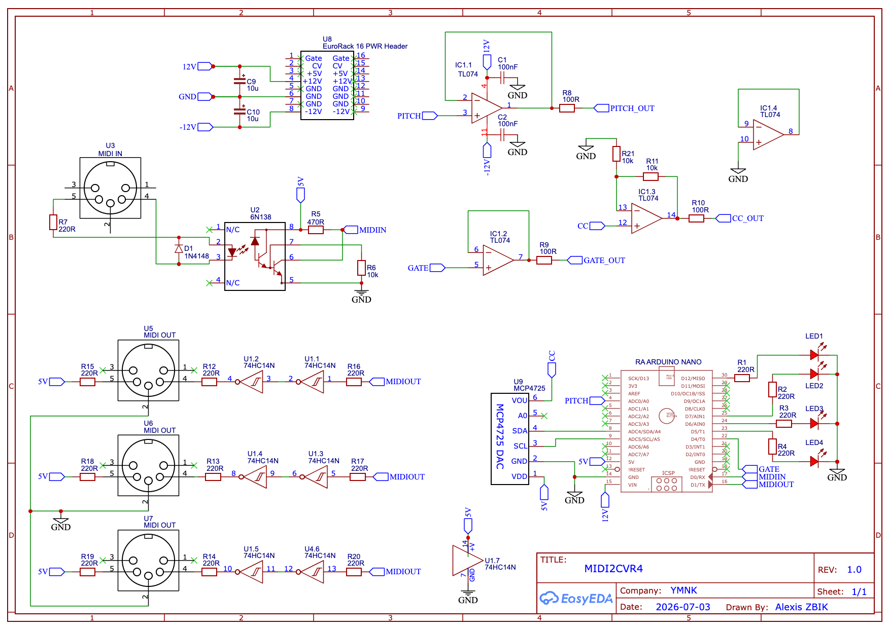

# MIDI2CVR4

**MIDI → CV** module based on an **Arduino Nano R4**. It converts MIDI messages into analog control signals (pitch, gate, CC) while providing **MIDI thru** to three DIN outputs.

## Features

- **1 MIDI input** (5-pin DIN, opto-isolated via 6N138)
- **3 MIDI outputs** (buffered thru via 74HC14)
- **Pitch CV** — 1 V/octave, 5 octaves (C2 → C7), 0–5 V output
- **Gate** — high gate output while a note is held
- **CC CV** — 0–10 V output driven by a MIDI Control Change message
- **4 activity LEDs** (MIDI, Pitch, Gate, CC)

## Arduino Nano R4 pinout

| Signal | Arduino pin | Description |
|--------|---------------|-------------|
| MIDI IN | `Serial1` (RX) | MIDI receive at 31,250 baud |
| MIDI OUT | `Serial1` (TX) | MIDI thru to the 3 DIN outputs |
| Pitch CV | Internal DAC | `analogWrite(DAC, …)` — 12-bit |
| CC CV | MCP4725 @ `0x60` | I2C bus (`A4` SDA, `A5` SCL) |
| Gate | D4 | Digital output |
| MIDI LED | D12 | Blinks on every MIDI message |
| Pitch LED | D7 | Blinks on every note |
| Gate LED | D6 | On while gate is active |
| CC LED | D5 | Blinks on every CC received |

Like the Nano Every, the Nano R4 uses `Serial1` instead of `Serial` for RX/TX.

## MIDI configuration

Parameters are defined at the top of [`midi2cvr4.ino`](midi2cvr4.ino).
You can change them directly in the code by updating the `#define` constants.

| Constant | Value | Effect |
|----------|-------|--------|
| `MIDI_CHANNEL` | `6` | MIDI channel filtered for CV outputs |
| `CC_CONTROL` | `31` | CC number driving the CC output |
| `MIN_C` | `36` | Reference note (C2) — start of the pitch range |

### Pitch

- Range: **5 octaves** starting from `MIN_C` (MIDI notes 36 to 96)
- Scale: **1 V/octave** on the internal DAC 0–5 V output

### Gate

- **HIGH** while a note is held (velocity > 0)
- **LOW** on note release

### CC

- CC #`31` on channel `6` is mapped from 0–127 to 0–4095 on the MCP4725
- The TL074 non-inverting amplifier (×2) brings the CC output to **0–10 V**

### MIDI thru

All received messages are forwarded to the three DIN outputs, regardless of channel.

## Arduino dependencies

Install via the **Library Manager**:

- [MIDI Library](https://github.com/FortySevenEffects/arduino_midi_library) (FortySevenEffects)
- [Adafruit MCP4725](https://github.com/adafruit/Adafruit_MCP4725_Library)

## Build and flash

1. Open `midi2cvr4.ino` in the Arduino IDE
2. Select the **Arduino Nano R4** board
3. Install the libraries listed above
4. Compile and upload

> **MCP4725 address**: the firmware uses `0x60` by default. If the DAC is not detected, try addresses `0x60` through `0x65` depending on the MCP4725 variant (A0, A1, A2) and ADDR pin wiring.
> Note: some MCP4725 boards require a solder bridge or jumper to set the address! If your MCP4725 is inconsistent, you need to do this.
